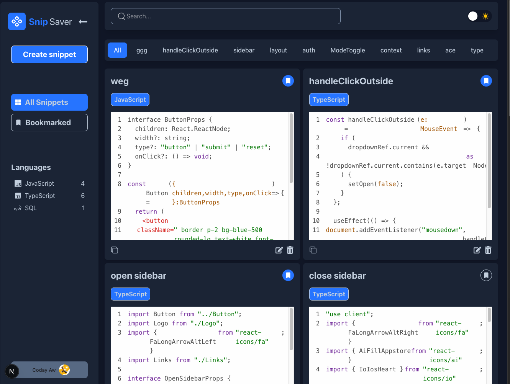
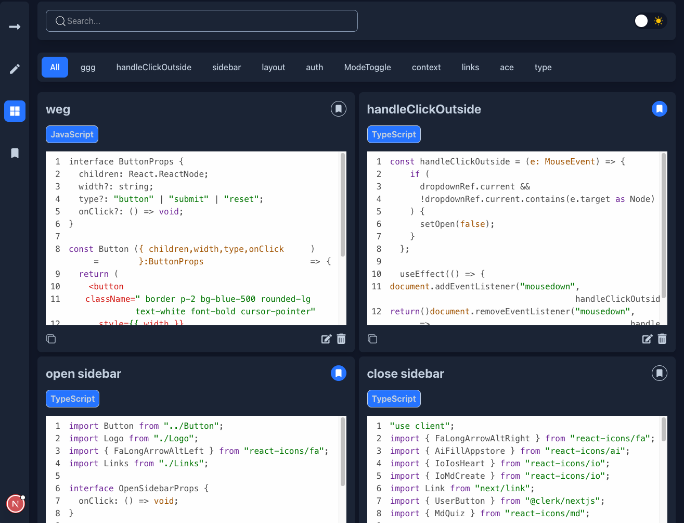
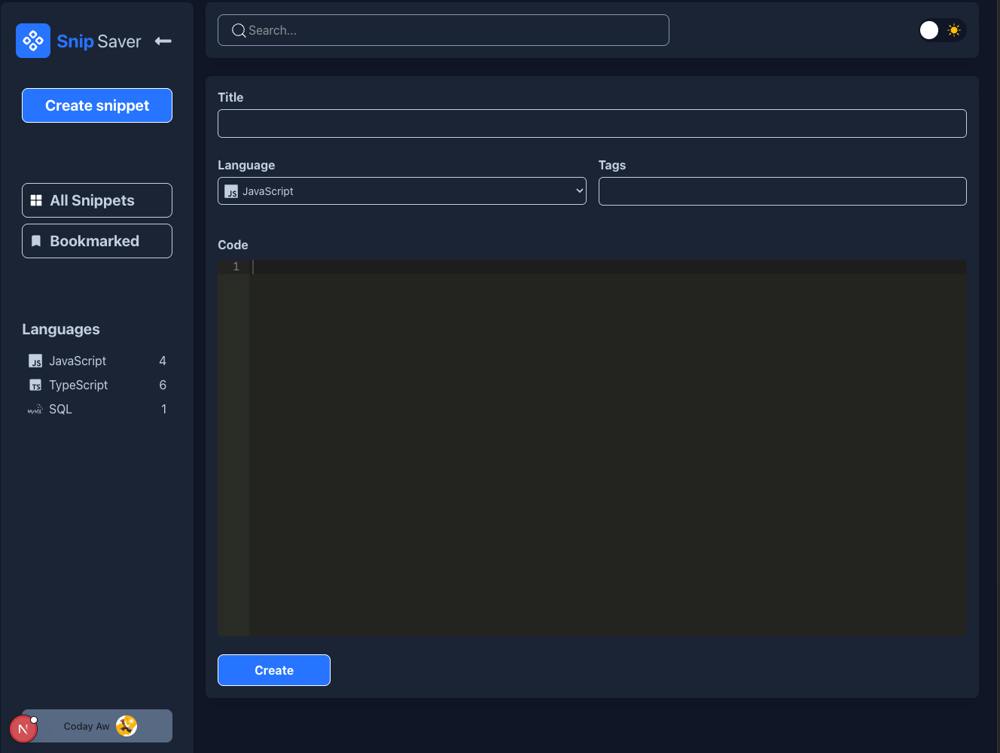
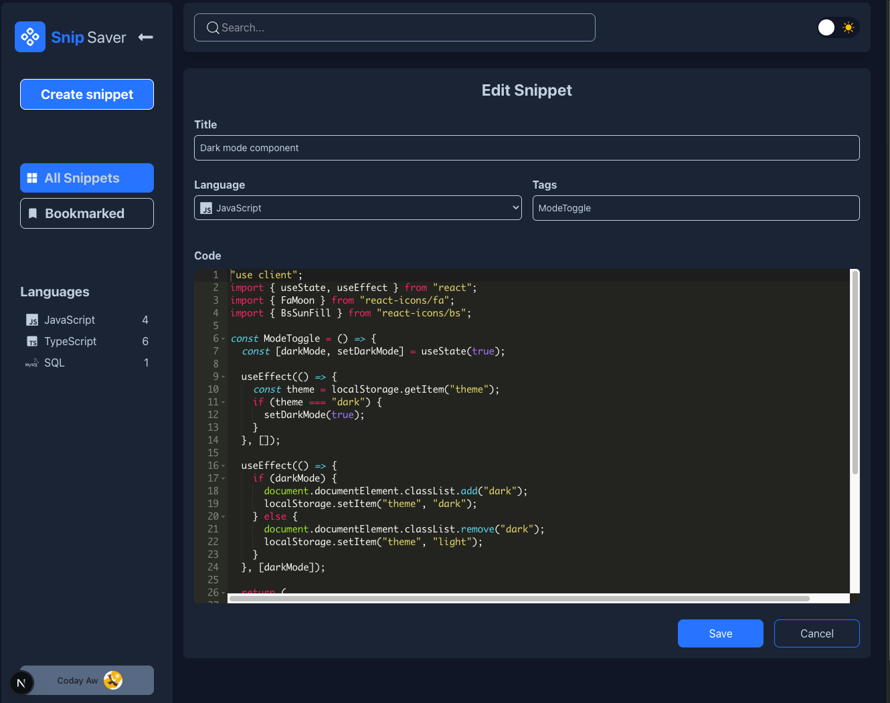
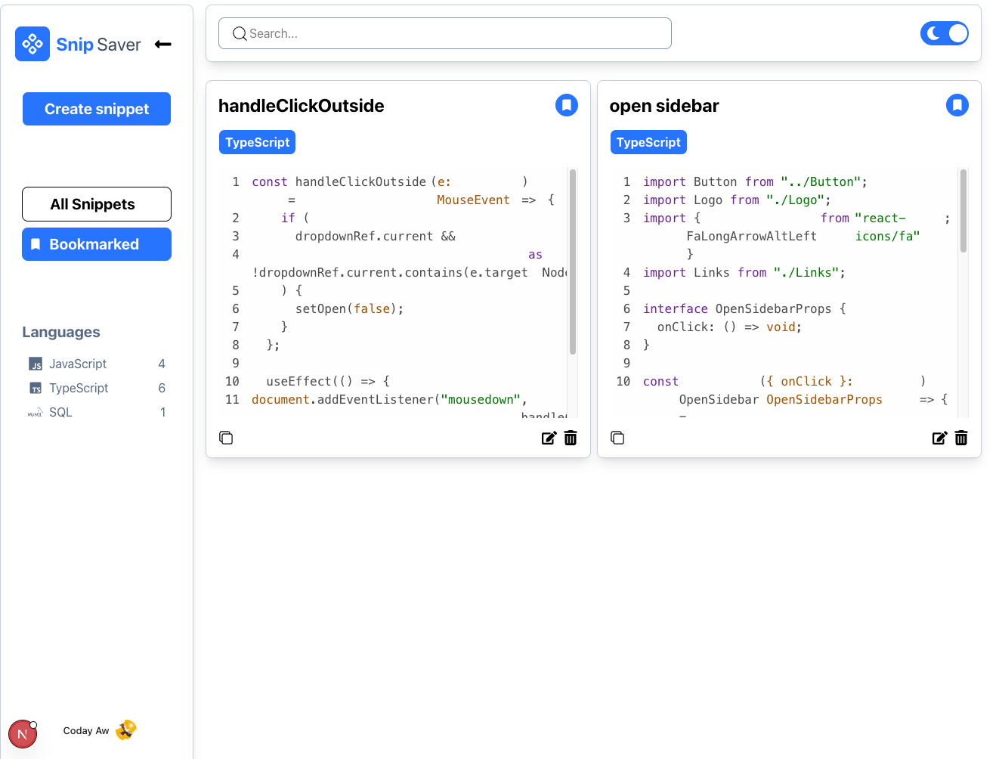

# Snip-Saver

Snip-Saver is a [Next.js](https://nextjs.org) project bootstrapped with [`create-next-app`](https://nextjs.org/docs/app/api-reference/cli/create-next-app). It allows users to save, edit, and manage code snippets.

## Tech Stack

- **Next.js**: A React framework for building fast and user-friendly web applications.
- **Supabase**: An open-source Firebase alternative for building secure and scalable applications.
- **Clerk**: Authentication and user management for modern applications.
- **TypeScript**: A strongly typed programming language that builds on JavaScript.
- **Tailwind CSS**: A utility-first CSS framework for rapid UI development.

## Features

- Save and manage code snippets
- Edit existing snippets
- copy saved snippets
- delete snippets
- Mark snippets as favorites
- Filter snippets by language and title

## Getting Started

## Pictures

### Dashboard



_The main landing page where users can get started with Snip-Saver_

### Create Snippet


_Form to create and save new code snippets with syntax highlighting_

### Edit Snippet


_Form to edit and update existing code snippets_

### Bookmarked Snippets


_View all your bookmarked code snippets in one place_

First, clone the repository:

```bash
git clone https://github.com/your-username/snip-saver.git
cd snip-saver
```

Then, install the dependencies:

```bash
npm install
# or
yarn install
# or
pnpm install
# or
bun install
```

Next, set up your environment variables. Create a `.env.local` file in the root of your project and add the following:

```env
NEXT_PUBLIC_CLERK_PUBLISHABLE_KEY=
CLERK_SECRET_KEY=
NEXT_PUBLIC_CLERK_AFTER_SIGN_IN_URL=/dashboard
NEXT_PUBLIC_CLERK_AFTER_SIGN_UP_URL=/dashboard
NEXT_PUBLIC_SUPABASE_URL=
NEXT_PUBLIC_SUPABASE_ANON_KEY=
```

Finally, run the development server:

```bash
npm run dev
# or
yarn dev
# or
pnpm dev
# or
bun dev
```

Open [http://localhost:3000](http://localhost:3000) with your browser to see the result.

## Learn More

To learn more about Next.js, take a look at the following resources:

- [Next.js Documentation](https://nextjs.org/docs) - learn about Next.js features and API.
- [Learn Next.js](https://nextjs.org/learn) - an interactive Next.js tutorial.

You can check out [the Next.js GitHub repository](https://github.com/vercel/next.js) - your feedback and contributions are welcome!

## Deploy on Vercel

The easiest way to deploy your Next.js app is to use the [Vercel Platform](https://vercel.com/new?utm_medium=default-template&filter=next.js&utm_source=create-next-app&utm_campaign=create-next-app-readme) from the creators of Next.js.

Check out our [Next.js deployment documentation](https://nextjs.org/docs/app/building-your-application/deploying) for more details.

## License

This project is licensed under the MIT License - see the [LICENSE](LICENSE) file for details.
